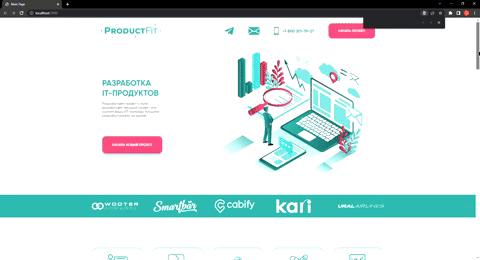

# \#ProductFit site
Website of a company that develops an IT product

## \#How to use
__Running code__
```
npm i
```
__After__
```
npm run dev
```
__For build project__
```
npm run build
```
## \#Demo
[https://leonidhr.github.io/product-fit/](https://leonidhr.github.io/product-fit/)

## \#Features
* Swiper with customn pagination on mobile
* Sending an email using PHPMailer



## \#Libraries

## \#Sending emails

__In order for sending letters to mail to work, you need to add the [PHPMailer pragin](https://github.com/PHPMailer/PHPMailer) to the root of the project__

[Swiper](https://swiperjs.com)

```js
import Swiper, { Navigation, Controller, Parallax, Pagination } from 'swiper';
```

### \#Dynamic adaptive
[Author](https://github.com/FreelancerLifeStyle/dynamic_adapt)
```
src/js/files/dynamic_adapt.js
```
__Using__

``` html
 <a data-da=".block,991.98,last" href="#">Button</a>

 <a data-da=".block,991.98,first" href="#">Button</a>
```

* First example: on a screen extension of 992px, the button is moved to the end of the block

* Second example: on a screen extension of 992px, the button is moved to the start of the block

src - source files. gulp - gulp config files. dist - ready files for perview. dist branch - project perview.